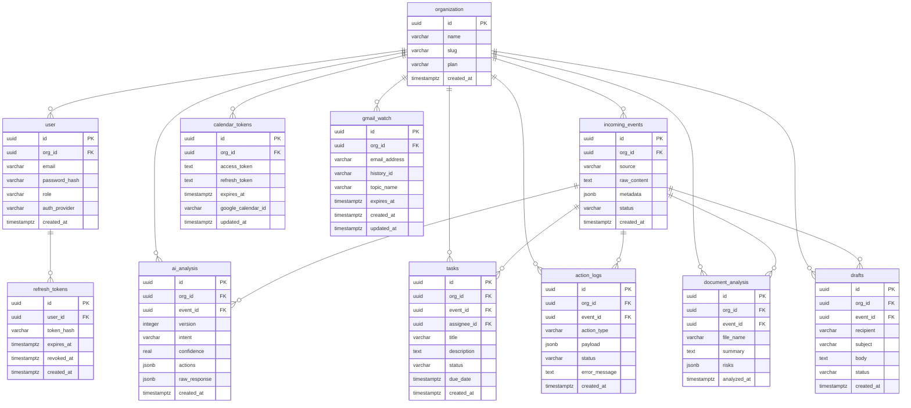

# DATA_MODELS.md

## Overview

The Mengu AI backend uses PostgreSQL exclusively. All tables are scoped to an `organization` to enforce multi-tenancy. No global, cross-org state exists.

---

## Table: `organization`

| Column        | Type         | Constraints       | Description                              |
|---------------|--------------|-------------------|------------------------------------------|
| id            | uuid         | PK, DEFAULT gen_random_uuid() | Unique organization identifier |
| name          | varchar(255) | NOT NULL           | Display name of the organization         |
| slug          | varchar(255) | UNIQUE, NOT NULL   | URL-friendly identifier                  |
| webhook_secret| varchar(255) | UNIQUE, NOT NULL   | Secret key for webhook authentication; maps incoming webhook to this organization |
| plan          | varchar(50)  | NOT NULL DEFAULT 'free' | Subscription plan tier (free, pro, enterprise) |
| created_at    | timestamptz  | NOT NULL DEFAULT now() | Row creation timestamp             |

**Explanation:** Every entity in the system belongs to exactly one organization. This table is the root of all data. Deleting an organization cascades to all child records. `webhook_secret` is used to authenticate incoming webhooks: when an email webhook arrives with `X-Webhook-Secret` header, the backend looks up the organization by this column to associate the event with the correct org.

---

## Table: `user`

| Column         | Type         | Constraints       | Description                              |
|----------------|--------------|-------------------|------------------------------------------|
| id             | uuid         | PK                | Unique user identifier                   |
| org_id         | uuid         | FK → organization(id), NOT NULL | Parent organization               |
| name           | varchar(255) | NOT NULL DEFAULT '' | Display name of the user              |
| email          | varchar(255) | UNIQUE, NOT NULL   | Login email                              |
| password_hash  | varchar(255) |                   | bcrypt hash (NULL for OAuth-only users)  |
| role           | varchar(50)  | NOT NULL DEFAULT 'employee' | RBAC role: admin, manager, employee, viewer |
| auth_provider  | varchar(50)  | NOT NULL DEFAULT 'email' | Authentication method: email, google, microsoft |
| created_at     | timestamptz  | NOT NULL DEFAULT now() | Row creation timestamp             |

**Explanation:** Users authenticate via email/password (JWT) or OAuth2 (Google, Microsoft). The `role` column drives all authorization checks. `password_hash` is nullable to support OAuth-only accounts where no local password is stored.

---

## Table: `incoming_events`

| Column      | Type         | Constraints       | Description                              |
|-------------|--------------|-------------------|------------------------------------------|
| id          | uuid         | PK                | Unique event identifier                  |
| org_id      | uuid         | FK → organization(id), NOT NULL | Parent organization               |
| source      | varchar(50)  | NOT NULL           | Origin of event: email, api, webhook, gmail |
| raw_content | text         | NOT NULL           | Full original email body                 |
| metadata    | jsonb        | NOT NULL DEFAULT '{}' | Structured metadata: sender, subject, attachments (array of objects with filename, content_type, size, url), headers |
| status      | varchar(50)  | NOT NULL DEFAULT 'new' | Processing status: new, processing, completed, failed |
| created_at  | timestamptz  | NOT NULL DEFAULT now() | Row creation timestamp             |

**Explanation:** This is the first persistence point when an email arrives via webhook. The `metadata` JSONB column stores sender address, subject line, attachment objects (filename, content_type, size, url), and email headers. The worker picks up rows where `status = 'new'` for AI analysis. The DocumentHandler uses `metadata.attachments[].url` to download files for analysis.

---

## Table: `ai_analysis`

| Column       | Type         | Constraints       | Description                              |
|--------------|--------------|-------------------|------------------------------------------|
| id           | uuid         | PK                | Unique analysis identifier               |
| org_id       | uuid         | FK → organization(id), NOT NULL | Parent organization               |
| event_id     | uuid         | FK → incoming_events(id), NOT NULL | Source event                     |
| version      | integer      | NOT NULL DEFAULT 1 | Analysis version (incremented on reanalysis) |
| intent       | varchar(255) | NOT NULL           | Classified intent label (e.g. meeting_request) |
| confidence   | real         | NOT NULL           | LLM confidence score (0.0 – 1.0)         |
| actions      | jsonb        | NOT NULL           | Structured action plan (JSON array)      |
| raw_response | jsonb        | NOT NULL           | Full LLM response for audit trail        |
| created_at   | timestamptz  | NOT NULL DEFAULT now() | Row creation timestamp             |

**Explanation:** Stores the structured output from the LLM. `actions` is a JSON array conforming to the strict output contract. `raw_response` preserves the complete LLM payload for debugging and audit. Multiple analyses can exist per event (e.g. after reanalysis); the `version` column tracks the sequence. The latest analysis for an event is the one with the highest version number.

---

## Table: `tasks`

| Column      | Type         | Constraints       | Description                              |
|-------------|--------------|-------------------|------------------------------------------|
| id          | uuid         | PK                | Unique task identifier                   |
| org_id      | uuid         | FK → organization(id), NOT NULL | Parent organization               |
| event_id    | uuid         | FK → incoming_events(id), NOT NULL | Originating event               |
| assignee_id | uuid         | FK → user(id), nullable | Assigned user (NULL = unassigned)     |
| title       | varchar(500) | NOT NULL           | Task title/summary                      |
| description | text         |                   | Detailed task description                |
| status      | varchar(50)  | NOT NULL DEFAULT 'new' | Task status: new, in_progress, done, cancelled |
| due_date    | timestamptz  |                   | Deadline for completion                  |
| created_at  | timestamptz  | NOT NULL DEFAULT now() | Row creation timestamp             |

**Explanation:** Created by the TaskHandler when the action engine encounters a `create_task` action. Each task is linked back to its originating event for full traceability.

---

## Table: `document_analysis`

| Column       | Type         | Constraints       | Description                              |
|--------------|--------------|-------------------|------------------------------------------|
| id           | uuid         | PK                | Unique document analysis identifier      |
| org_id       | uuid         | FK → organization(id), NOT NULL | Parent organization               |
| event_id     | uuid         | FK → incoming_events(id), NOT NULL | Originating event               |
| file_name    | varchar(500) | NOT NULL           | Original attachment filename             |
| summary      | text         |                   | AI-generated summary of the document     |
| risks        | jsonb        | NOT NULL DEFAULT '[]' | Array of risk strings extracted by AI |
| analyzed_at  | timestamptz  | NOT NULL DEFAULT now() | When analysis completed             |

**Explanation:** Stores the result of the `analyze_document` action. The DocumentHandler extracts text from the attachment, sends it to `AIClient.AnalyzeDocument`, and stores the returned summary and risks array. Multiple analyses can exist per event if there are multiple attachments.

---

## Table: `drafts`

| Column      | Type         | Constraints       | Description                              |
|-------------|--------------|-------------------|------------------------------------------|
| id          | uuid         | PK                | Unique draft identifier                  |
| org_id      | uuid         | FK → organization(id), NOT NULL | Parent organization               |
| event_id    | uuid         | FK → incoming_events(id), NOT NULL | Originating event               |
| recipient   | varchar(255) | NOT NULL           | Recipient email address                  |
| subject     | varchar(500) | NOT NULL           | Email subject line                       |
| body        | text         | NOT NULL           | Email body content (plain text)          |
| status      | varchar(50)  | NOT NULL DEFAULT 'pending_approval' | Draft status: pending_approval, approved, sent, rejected |
| created_at  | timestamptz  | NOT NULL DEFAULT now() | Row creation timestamp             |

**Explanation:** Stores email drafts generated by the `send_email_draft` action. The EmailDraftHandler calls `AIClient.GenerateDraft` to produce the reply and stores it here. Drafts are **never** sent automatically — a human must approve them via `PATCH /api/v1/drafts/:id/approve`.

---

## Table: `refresh_tokens`

| Column     | Type         | Constraints       | Description                              |
|------------|--------------|-------------------|------------------------------------------|
| id         | uuid         | PK                | Unique token identifier                  |
| user_id    | uuid         | FK → user(id), NOT NULL | Owner of the token                  |
| token_hash | varchar(255) | UNIQUE, NOT NULL   | SHA-256 hash of the refresh token        |
| expires_at | timestamptz  | NOT NULL           | Token expiration timestamp               |
| revoked_at | timestamptz  |                   | NULL if active, set on logout/refresh    |
| created_at | timestamptz  | NOT NULL DEFAULT now() | Row creation timestamp             |

**Explanation:** Stores JWT refresh tokens. When a user logs in, a refresh token is issued and stored (hashed). On token refresh, the old token is revoked and a new one is issued. On logout, all active tokens for the user are revoked. This enables session management and invalidation.

---

## Table: `calendar_tokens`

| Column        | Type         | Constraints       | Description                              |
|---------------|--------------|-------------------|------------------------------------------|
| id            | uuid         | PK                | Unique token record identifier           |
| org_id        | uuid         | FK → organization(id), UNIQUE, NOT NULL | Organization that owns these tokens |
| access_token  | text         | NOT NULL           | Google Calendar API access token         |
| refresh_token | text         | NOT NULL           | Google Calendar API refresh token        |
| expires_at    | timestamptz  | NOT NULL           | Access token expiration                  |
| google_calendar_id | varchar(255) |               | Specific calendar ID (NULL = primary)    |
| updated_at    | timestamptz  | NOT NULL DEFAULT now() | Last token refresh timestamp        |

**Explanation:** Stores OAuth2 tokens for Google Calendar integration. Used by MeetingHandler to create calendar events. The `org_id` UNIQUE constraint enforces one token set per organization. Tokens are obtained via the initial OAuth2 authorization flow and refreshed automatically when expired.

---

## Table: `gmail_watch`

| Column       | Type         | Constraints       | Description                              |
|--------------|--------------|-------------------|------------------------------------------|
| id           | uuid         | PK                | Unique watch record identifier           |
| org_id       | uuid         | FK → organization(id), UNIQUE, NOT NULL | Organization that owns this watch |
| email_address| varchar(255) | NOT NULL           | Gmail mailbox being watched              |
| history_id   | varchar(100) | NOT NULL           | Current Gmail history ID for incremental sync |
| topic_name   | varchar(255) | NOT NULL           | Google Cloud Pub/Sub topic name          |
| expires_at   | timestamptz  | NOT NULL           | Watch expiration timestamp (Google requires re-watch every 7 days) |
| created_at   | timestamptz  | NOT NULL DEFAULT now() | Row creation timestamp             |
| updated_at   | timestamptz  | NOT NULL DEFAULT now() | Last watch renewal timestamp       |

**Explanation:** Tracks active Gmail API watches per organization. When the Gmail API `watch()` endpoint is called, it returns a `history_id` and the watch is active for 7 days. The background watcher renews the watch before expiry. When a Pub/Sub push notification arrives at `POST /webhooks/gmail`, the backend uses `org_id` (looked up via `email_address`) and `history_id` to fetch only new messages via `users.history.list()`.

---

## Table: `action_logs`

| Column        | Type         | Constraints       | Description                              |
|---------------|--------------|-------------------|------------------------------------------|
| id            | uuid         | PK                | Unique log identifier                    |
| org_id        | uuid         | FK → organization(id), NOT NULL | Parent organization               |
| event_id      | uuid         | FK → incoming_events(id), NOT NULL | Originating event               |
| action_type   | varchar(100) | NOT NULL           | Action type: schedule_meeting, create_task, send_email_draft, analyze_document |
| payload       | jsonb        | NOT NULL DEFAULT '{}' | Action-specific data payload         |
| status        | varchar(50)  | NOT NULL           | Execution result: success, failed, skipped |
| error_message | text         |                   | Error details if action failed           |
| created_at    | timestamptz  | NOT NULL DEFAULT now() | Row creation timestamp             |

**Explanation:** Every action execution produces exactly one row in `action_logs`. This provides full auditability: for any event, you can see which actions were attempted, their input payloads, and whether they succeeded or failed.

---

## Entity Relationships

```
organization ──┐
               ├──< user (1:N)
               ├──< calendar_tokens (1:1)
               ├──< gmail_watch (1:1)
               ├──< incoming_events (1:N)
               ├──< ai_analysis (1:N)
               ├──< tasks (1:N)
               ├──< document_analysis (1:N)
               ├──< drafts (1:N)
               └──< action_logs (1:N)

user ──< refresh_tokens (1:N)

incoming_events ──< ai_analysis (1:N, via event_id)
incoming_events ──< tasks (1:N, via event_id)
incoming_events ──< document_analysis (1:N, via event_id)
incoming_events ──< drafts (1:N, via event_id)
incoming_events ──< action_logs (1:N, via event_id)
```

---

## Data Flow

```
Email arrives (webhook)
       │
       ▼
  incoming_events (status=new)
       │
       ▼
  Worker → AIClient.AnalyzeEmail() → LLM
       │
       ▼
  ai_analysis (intent + actions JSON)
       │
       ▼
  Action Engine iterates actions (sequential, ordered)
       │
       ├── schedule_meeting  → MeetingHandler  → Google Calendar API → action_logs
       ├── create_task       → TaskHandler     → tasks table          → action_logs
       ├── analyze_document  → DocumentHandler → AIClient.AnalyzeDocument() → document_analysis table → action_logs
       └── send_email_draft  → EmailDraftHandler → AIClient.GenerateDraft() → drafts table → action_logs
```

---

## ERD Diagram (Mermaid)



---

## Top-Down Data Flow (ASCII)

```
                        ┌──────────────────┐
                        │   Organization    │
                        │   ─────────────   │
                        │   org_123         │
                        └────────┬─────────┘
                                 │
                   ┌─────────────┼───────────────────────┐
                   │             │                        │
            ┌──────▼──────┐     │                  ┌─────▼──────┐
            │    User     │     │                  │  Incoming  │
            │  ─────────  │     │                  │   Events   │
            │  admin@...  │     │                  │  ───────── │
            │  manager@.. │     │                  │  evt_001   │
            └─────────────┘     │                  └─────┬──────┘
                                 │                        │
                                 │                  ┌─────▼──────┐
                                 │                  │ AI Analysis │
                                 │                  │ ─────────── │
                                 │                  │ analysis_001│
                                 │                  │ actions: [  │
                                 │                  │  schedule.. │
                                 │                  │  create_..  │
                                 │                  │  analyze..  │
                                 │                  │  draft..    │
                                 │                  └──────┬──────┘
                                 │                         │
                    ┌────────────┼──────────────┬───────────┼───────────┐
                    │            │              │           │           │
             ┌──────▼──────┐    │    ┌─────────▼────┐  ┌───▼─────┐    │
             │   Tasks     │    │    │ Action Logs  │  │ Drafts  │    │
             │  ─────────  │    │    │ ──────────── │  │ ─────── │    │
             │  task_001   │    │    │ meeting→ok   │  │ draft_  │    │
             │             │    │    │ task→ok      │  │ 001     │    │
             └─────────────┘    │    │ doc→ok       │  └─────────┘    │
                                │    │ draft→ok     │                 │
                                │    └──────────────┘                 │
                                │                                     │
                     ┌──────────▼──────────┐                          │
                     │ Document Analysis   │                          │
                     │ ─────────────────── │                          │
                     │ doc_analysis_001    │                          │
                     └─────────────────────┘                          │
```

---

## READY SQL Queries

### Table Creation

```sql
CREATE TABLE organization (
    id             UUID PRIMARY KEY DEFAULT gen_random_uuid(),
    name           VARCHAR(255) NOT NULL,
    slug           VARCHAR(255) UNIQUE NOT NULL,
    webhook_secret VARCHAR(255) UNIQUE NOT NULL,
    plan           VARCHAR(50) NOT NULL DEFAULT 'free',
    created_at     TIMESTAMPTZ NOT NULL DEFAULT now()
);

CREATE TABLE "user" (
    id             UUID PRIMARY KEY DEFAULT gen_random_uuid(),
    org_id         UUID NOT NULL REFERENCES organization(id) ON DELETE CASCADE,
    name           VARCHAR(255) NOT NULL DEFAULT '',
    email          VARCHAR(255) UNIQUE NOT NULL,
    password_hash  VARCHAR(255),
    role           VARCHAR(50) NOT NULL DEFAULT 'employee',
    auth_provider  VARCHAR(50) NOT NULL DEFAULT 'email',
    created_at     TIMESTAMPTZ NOT NULL DEFAULT now()
);

CREATE TABLE refresh_tokens (
    id         UUID PRIMARY KEY DEFAULT gen_random_uuid(),
    user_id    UUID NOT NULL REFERENCES "user"(id) ON DELETE CASCADE,
    token_hash VARCHAR(255) UNIQUE NOT NULL,
    expires_at TIMESTAMPTZ NOT NULL,
    revoked_at TIMESTAMPTZ,
    created_at TIMESTAMPTZ NOT NULL DEFAULT now()
);

CREATE TABLE calendar_tokens (
    id                UUID PRIMARY KEY DEFAULT gen_random_uuid(),
    org_id            UUID UNIQUE NOT NULL REFERENCES organization(id) ON DELETE CASCADE,
    access_token      TEXT NOT NULL,
    refresh_token     TEXT NOT NULL,
    expires_at        TIMESTAMPTZ NOT NULL,
    google_calendar_id VARCHAR(255),
    updated_at        TIMESTAMPTZ NOT NULL DEFAULT now()
);

CREATE TABLE gmail_watch (
    id            UUID PRIMARY KEY DEFAULT gen_random_uuid(),
    org_id        UUID UNIQUE NOT NULL REFERENCES organization(id) ON DELETE CASCADE,
    email_address VARCHAR(255) NOT NULL,
    history_id    VARCHAR(100) NOT NULL,
    topic_name    VARCHAR(255) NOT NULL,
    expires_at    TIMESTAMPTZ NOT NULL,
    created_at    TIMESTAMPTZ NOT NULL DEFAULT now(),
    updated_at    TIMESTAMPTZ NOT NULL DEFAULT now()
);

CREATE TABLE incoming_events (
    id          UUID PRIMARY KEY DEFAULT gen_random_uuid(),
    org_id      UUID NOT NULL REFERENCES organization(id) ON DELETE CASCADE,
    source      VARCHAR(50) NOT NULL,
    raw_content TEXT NOT NULL,
    metadata    JSONB NOT NULL DEFAULT '{}',
    status      VARCHAR(50) NOT NULL DEFAULT 'new',
    created_at  TIMESTAMPTZ NOT NULL DEFAULT now()
);

CREATE TABLE ai_analysis (
    id           UUID PRIMARY KEY DEFAULT gen_random_uuid(),
    org_id       UUID NOT NULL REFERENCES organization(id) ON DELETE CASCADE,
    event_id     UUID NOT NULL REFERENCES incoming_events(id) ON DELETE CASCADE,
    version      INTEGER NOT NULL DEFAULT 1,
    intent       VARCHAR(255) NOT NULL,
    confidence   REAL NOT NULL,
    actions      JSONB NOT NULL,
    raw_response JSONB NOT NULL,
    created_at   TIMESTAMPTZ NOT NULL DEFAULT now()
);

CREATE TABLE tasks (
    id          UUID PRIMARY KEY DEFAULT gen_random_uuid(),
    org_id      UUID NOT NULL REFERENCES organization(id) ON DELETE CASCADE,
    event_id    UUID NOT NULL REFERENCES incoming_events(id) ON DELETE CASCADE,
    assignee_id UUID REFERENCES "user"(id) ON DELETE SET NULL,
    title       VARCHAR(500) NOT NULL,
    description TEXT,
    status      VARCHAR(50) NOT NULL DEFAULT 'new',
    due_date    TIMESTAMPTZ,
    created_at  TIMESTAMPTZ NOT NULL DEFAULT now()
);

CREATE TABLE document_analysis (
    id            UUID PRIMARY KEY DEFAULT gen_random_uuid(),
    org_id        UUID NOT NULL REFERENCES organization(id) ON DELETE CASCADE,
    event_id      UUID NOT NULL REFERENCES incoming_events(id) ON DELETE CASCADE,
    file_name     VARCHAR(500) NOT NULL,
    summary       TEXT,
    risks         JSONB NOT NULL DEFAULT '[]',
    analyzed_at   TIMESTAMPTZ NOT NULL DEFAULT now()
);

CREATE TABLE drafts (
    id        UUID PRIMARY KEY DEFAULT gen_random_uuid(),
    org_id    UUID NOT NULL REFERENCES organization(id) ON DELETE CASCADE,
    event_id  UUID NOT NULL REFERENCES incoming_events(id) ON DELETE CASCADE,
    recipient VARCHAR(255) NOT NULL,
    subject   VARCHAR(500) NOT NULL,
    body      TEXT NOT NULL,
    status    VARCHAR(50) NOT NULL DEFAULT 'pending_approval',
    created_at TIMESTAMPTZ NOT NULL DEFAULT now()
);

CREATE TABLE action_logs (
    id            UUID PRIMARY KEY DEFAULT gen_random_uuid(),
    org_id        UUID NOT NULL REFERENCES organization(id) ON DELETE CASCADE,
    event_id      UUID NOT NULL REFERENCES incoming_events(id) ON DELETE CASCADE,
    action_type   VARCHAR(100) NOT NULL,
    payload       JSONB NOT NULL DEFAULT '{}',
    status        VARCHAR(50) NOT NULL,
    error_message TEXT,
    created_at    TIMESTAMPTZ NOT NULL DEFAULT now()
);
```

### Indexes

```sql
CREATE INDEX idx_user_org ON "user"(org_id);
CREATE INDEX idx_incoming_events_org_status ON incoming_events(org_id, status);
CREATE UNIQUE INDEX idx_ai_analysis_event_version ON ai_analysis(event_id, version);
CREATE INDEX idx_ai_analysis_event ON ai_analysis(event_id);
CREATE INDEX idx_tasks_org ON tasks(org_id);
CREATE INDEX idx_tasks_event ON tasks(event_id);
CREATE INDEX idx_action_logs_event ON action_logs(event_id);
CREATE INDEX idx_action_logs_org ON action_logs(org_id);
CREATE INDEX idx_document_analysis_event ON document_analysis(event_id);
CREATE INDEX idx_drafts_event ON drafts(event_id);
CREATE INDEX idx_refresh_tokens_user ON refresh_tokens(user_id);
CREATE INDEX idx_refresh_tokens_hash ON refresh_tokens(token_hash);
CREATE INDEX idx_gmail_watch_org ON gmail_watch(org_id);
```
